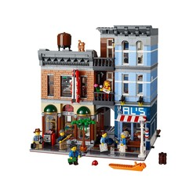
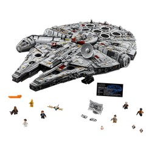
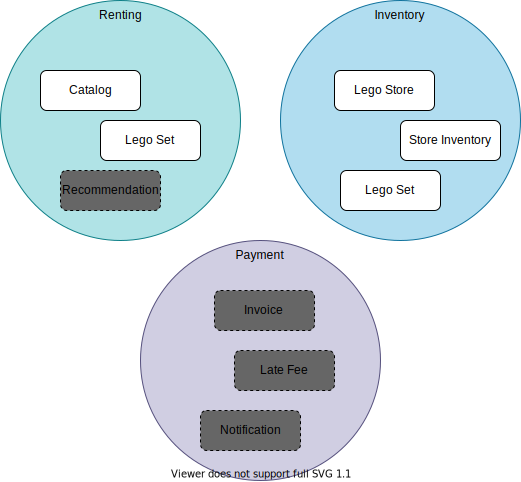
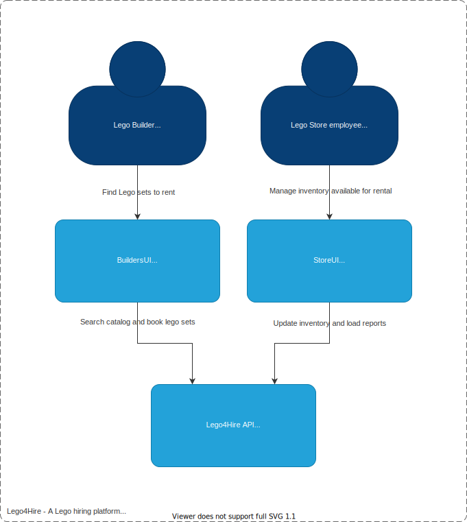

# Lego 4 Rent

This is a sample app to demonstrate the power of using EventSourced models and the ease with which these can be modelled
using Kotlin.

To get an idea how this works in real-live, look at sites like: [www.bricksverhuur.nl](https://www.bricksverhuur.nl)

## How to use

This code is intended to be used as part of a workshop, where you start with a basic part of the application and use the
stories defined below to add bits and pieces of functionality by making use of EventSourcing and CQRS.

## Context Map

The [Context Map](https://www.infoq.com/articles/ddd-contextmapping/) below gives an impression of the domains at play
for renting out lego sets and the concepts that play a role in that.

The greyed out blocks are parts that are have been left out of this sample, but could be interesting to explore if you
want to add additional functionality for it.

## EventStorming

TODO

## Architecture

Below is a [C4 Container diagram](https://c4model.com/#ContainerDiagram) that gives an impression of the high-level
architecture of the complete application.

At this moment, only the code for the Lego4Hire API server is included in this codebase. The UIs might be added later.

## Data flow

TODO

## Stories

### Story 1

Look at the code that saves events to the event store and publishes events.

See [KeyValueBasedEventStore](src/main/kotlin/eu/luminis/workshops/kdd/system/eventstore/KeyValueBasedEventStore.kt)

    What could go wrong here?

Once you've figured that out, what could you do to prevent that?

    Write down your suggested approach to resolve that and ping the trainer.

What do you think? Do you need a framework or library to solve this?

### Story 2

As a store, I want to see which sets are most popular, So I can plan which ones to keep on stock.

Build the following.

- Projection for report of popular sets
  - Result table:
    - set nr (random from catalog)
    - set name (idem)
    - times booked last 2 weeks (desc)
    - times booked (last 2 months)
    - times booked (all time)

Sample test data and a test case are already in place.

    Remove the @Ignore on PopularSetsProjectionTest and make it pass.

### Story 3

You find out that some events coming from the integration event bus are being received twice.

How could you ensure that events are only handled once? (i.e. idempotent event processing)

When done, review your implementation. What do you think? Do you need a framework or library for this?

## Backlog

- Story: As a store, I want to see how many builders return their sets late and by how many days, So that I can decide
  how to deal with late returns
  - Projection: Report of late returns
    - Result table:
      - Days late
      - Nr of bookings

- Story: As a lego builder, I want to book multiple sets of the same type, So I can throw a lego party and me and my
  friends can see who can build it the fastest.
  - Adjust command to indicate book for that set
  - Easy: should be trivial to add amount to command and adjust event, projections etc should just work

- Story: As a store, I want to be notified of late returns over 2 days, So that we can send invoices for late fees.
  - [Inventory] Projection: capture booking and return events, store booking events with date.
    - On return, calculate amount overdue and publish integration event
  - [Payment]: capture overdue events and if > 2 days, send notification email

- Story: As a store, I want automated notifications to be sent out to builders that need to return their sets in 3 days
  and have not already done so, So that they hopefully return their sets before we have to invoice late fees.
  _Late fee handling is costing us a lot of time, and the fees are not good for the satisfaction ratings of builders, so
  we'd rather prevent them._
  - [Inventory] Projection: track events about bookings and returns, keep track of open bookings.
  - On schedule: look at open bookings, if booking date results in almost needing to return, send reminder.

- Story: As a store, I want to register when a booking is shipped to a builder, So that we can track which builders have
  which of our sets.
  - View booked sets that need to be shipped
  - Address of builder
  - Add command: Set shipped

- Story: As a lego builder, I want to book multiple sets at once, So I only have to pay shipping once.
  - Add command or adjust existing command
  - Problem: booking is now per set... just handle in service? Or change aggregate to 'multiple sets'?

- Story: As a lego builder, I want to share photos of my build, So I can show off my sick building skills.
